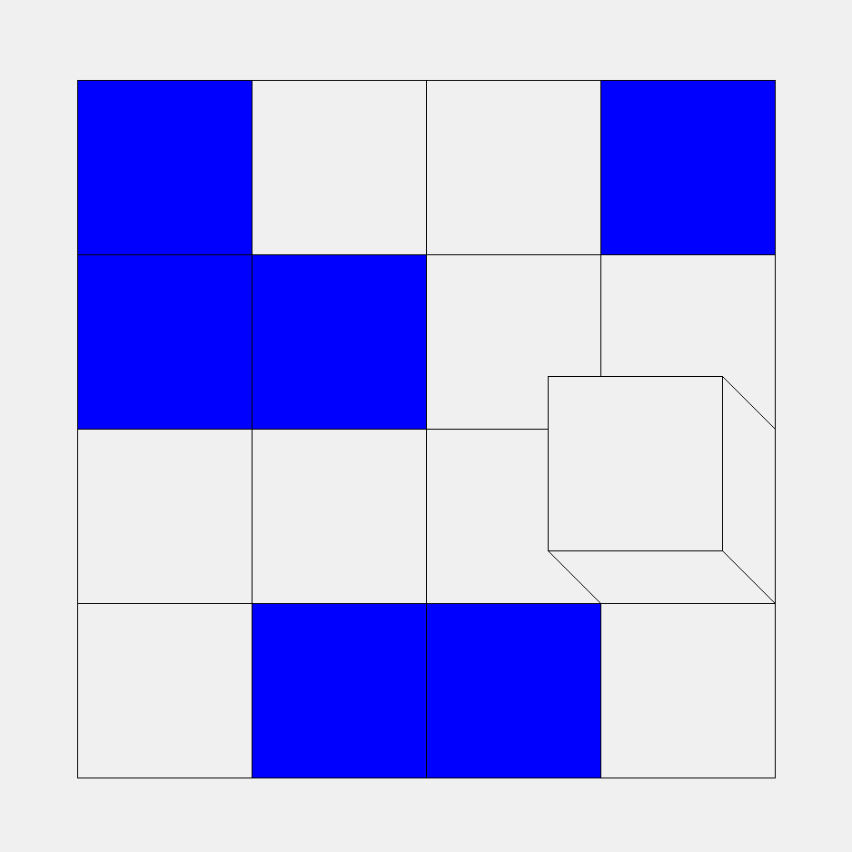
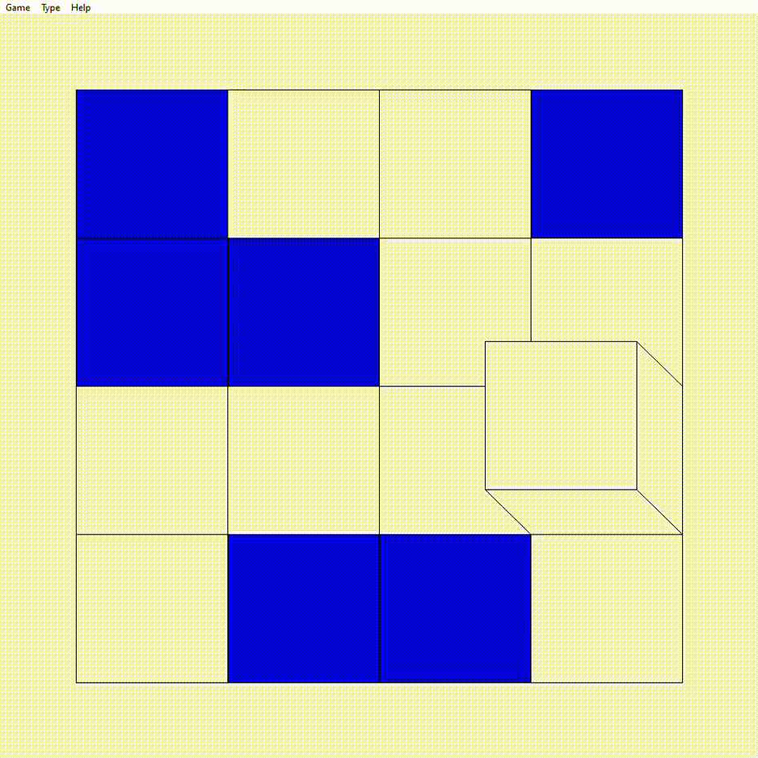

# Rolling Cube

## About

Rolling Cube is an optimal solver for one of [Simon Tatham's Portable Puzzle Collection](https://www.chiark.greenend.org.uk/~sgtatham/puzzles/) game, called Cube.

## Example

Here is example game



And Solution



## Building

To compile the source code use makefile

```bash
make cube
```

## Usage

Then run program on [example input](example/cube.in)

```bash
./cube < example/cube.in
```
